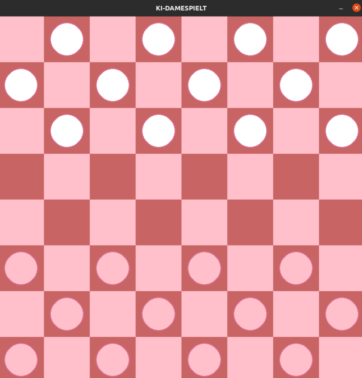

<div align="center">



</div>

<h1 align="center" style="margin-top: 0px;"><b>Dameprogramme</b> - A Checkers' AI Agent</h1>
<h2 align="center" style="margin-top: 0px;">Betriebssysteme und Rechnernetzwerke</h2>

# Introduction

This project consists of the implementation of an AI agent using the Minimax algorithm with alpha-beta pruning. The original code is not public yet under college policies, however the main algorithm can be found in the .pdf file on the repository. 

[Download the PDF document](./23ss_carsigonzalez_dameprogramme.pdf)

# Requirements

## Hardware
## Software
-  python >= 3.11

# Getting Started
## Clone The Repository

```sh
git clone https://github.com/anacarsi/23ss-MinimaxCheckers.git
cd 23ss-MinimaxCheckers
```

## Create A Virtual Environment (optional):

### With conda

```sh
conda create -n checkers
conda activate checkers
```

## Install

### Install the package

```sh
pip install -e .
```

# Citation
```bibtex
@software{
    author = {Ana Carsi},
    title = {SmartPlay: An AI Agent for Checker's Gameplay},
    month = mar,
    year = 2022,
    publisher = {GitHub},
    version = {0.1.0},
    url = {https://github.com/anacarsi/23ss-MinimaxCheckers}

}
}
```
